# Pattern Printing Based on Alphabets

&nbsp;

## Square Patterns

<table>
  <tr>
    <th>Sr No</th>
    <th>Pattern</th>
    <th>Code</th>
  </tr>

  <tr>
    <td>1</td>
    <td>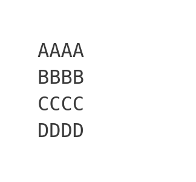</td>
    <td><a href="alpha_pattern_square_01.cpp">alpha_pattern_square_01</a></td>
  </tr>
  
  <tr>
    <td>2</td>
    <td>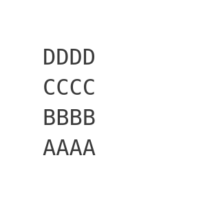</td>
    <td><a href="alpha_pattern_square_02.cpp">alpha_pattern_square_02</a></td>
  </tr>
    
  <tr>
    <td>3</td>
    <td>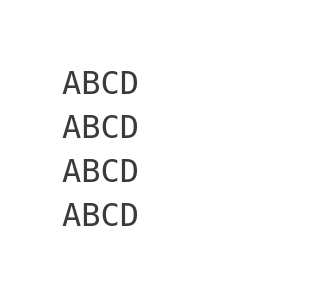</td>
    <td><a href="alpha_pattern_square_03.cpp">alpha_pattern_square_03</a></td>
  </tr>
    
  <tr>
    <td>4</td>
    <td>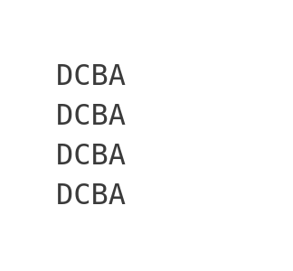</td>
    <td><a href="alpha_pattern_square_04.cpp">alpha_pattern_square_04</a></td>
  </tr>
    
  <tr>
    <td>5</td>
    <td></td>
    <td><a href="alpha_pattern_square_05.cpp">alpha_pattern_square_05</a></td>
  </tr>
</table>

&nbsp;

## Triangle Patterns

### Type 1

<table>
  <tr>
    <th>Sr No</th>
    <th>Pattern</th>
    <th>Code</th>
  </tr>
  
  <tr>
    <td>1</td>
    <td>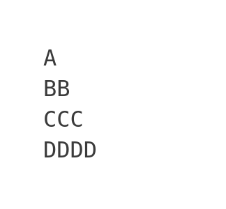</td>
    <td><a href="alpha_pattern_triangle1_01.cpp">alpha_pattern_triangle1_01</a></td>
  </tr>
  
  <tr>
    <td>2</td>
    <td>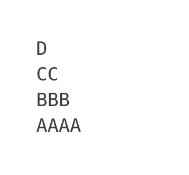</td>
    <td><a href="alpha_pattern_triangle1_02.cpp">alpha_pattern_triangle1_02</a></td>
  </tr>
    
  <tr>
    <td>3</td>
    <td>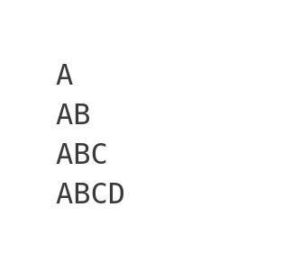</td>
    <td><a href="alpha_pattern_triangle1_03.cpp">alpha_pattern_triangle1_03</a></td>
  </tr>
    
  <tr>
    <td>4</td>
    <td>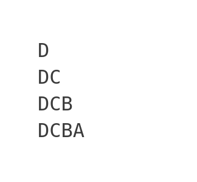</td>
    <td><a href="alpha_pattern_triangle1_04.cpp">alpha_pattern_triangle1_04</a></td>
  </tr>
</table>

### Type 2

<table>
  <tr>
    <th>Sr No</th>
    <th>Pattern</th>
    <th>Code</th>
  </tr>
  
  <tr>
    <td>1</td>
    <td>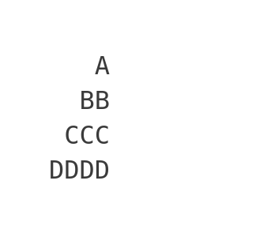</td>
    <td><a href="alpha_pattern_triangle2_01.cpp">alpha_pattern_triangle2_01</a></td>
  </tr>
  
  <tr>
    <td>2</td>
    <td>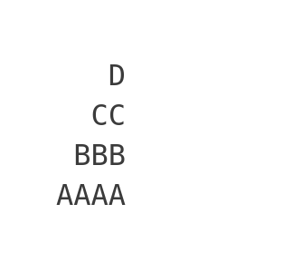</td>
    <td><a href="alpha_pattern_triangle2_02.cpp">alpha_pattern_triangle2_02</a></td>
  </tr>
    
  <tr>
    <td>3</td>
    <td>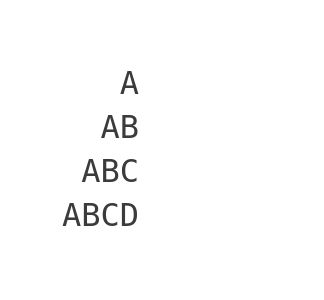</td>
    <td><a href="alpha_pattern_triangle2_03.cpp">alpha_pattern_triangle2_03</a></td>
  </tr>
    
  <tr>
    <td>4</td>
    <td>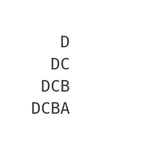</td>
    <td><a href="alpha_pattern_triangle2_04.cpp">alpha_pattern_triangle2_04</a></td>
  </tr>
</table>

### Type 3

<table>
  <tr>
    <th>Sr No</th>
    <th>Pattern</th>
    <th>Code</th>
  </tr>
  
  <tr>
    <td>1</td>
    <td>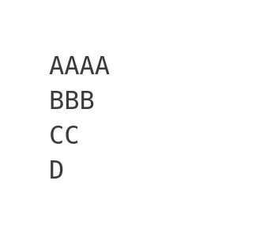</td>
    <td><a href="alpha_pattern_triangle3_01.cpp">alpha_pattern_triangle3_01</a></td>
  </tr>
  
  <tr>
    <td>2</td>
    <td>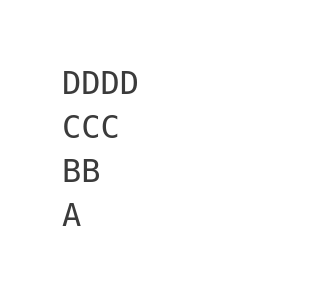</td>
    <td><a href="alpha_pattern_triangle3_02.cpp">alpha_pattern_triangle3_02</a></td>
  </tr>
    
  <tr>
    <td>3</td>
    <td>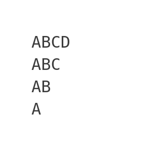</td>
    <td><a href="alpha_pattern_triangle3_03.cpp">alpha_pattern_triangle3_03</a></td>
  </tr>
    
  <tr>
    <td>4</td>
    <td>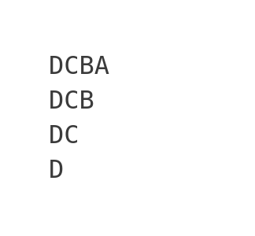</td>
    <td><a href="alpha_pattern_triangle3_04.cpp">alpha_pattern_triangle3_04</a></td>
  </tr>
</table>

### Type 4

<table>
  <tr>
    <th>Sr No</th>
    <th>Pattern</th>
    <th>Code</th>
  </tr>
  
  <tr>
    <td>1</td>
    <td>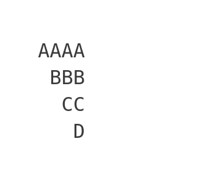</td>
    <td><a href="alpha_pattern_triangle4_01.cpp">alpha_pattern_triangle4_01</a></td>
  </tr>
  
  <tr>
    <td>2</td>
    <td>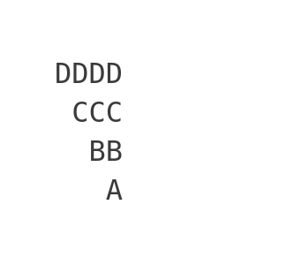</td>
    <td><a href="alpha_pattern_triangle4_02.cpp">alpha_pattern_triangle4_02</a></td>
  </tr>
    
  <tr>
    <td>3</td>
    <td>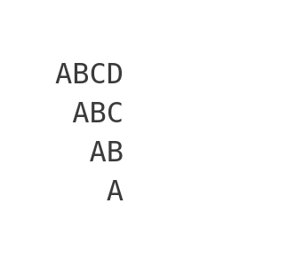</td>
    <td><a href="alpha_pattern_triangle4_03.cpp">alpha_pattern_triangle4_03</a></td>
  </tr>
    
  <tr>
    <td>4</td>
    <td>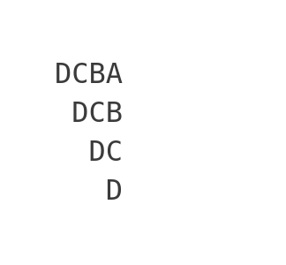</td>
    <td><a href="alpha_pattern_triangle4_04.cpp">alpha_pattern_triangle4_04</a></td>
  </tr>
</table>

&nbsp;

## Pyramid Patterns

### Type 1

<table>
  <tr>
    <th>Sr No</th>
    <th>Pattern</th>
    <th>Code</th>
  </tr>
  
  <tr>
    <td>1</td>
    <td>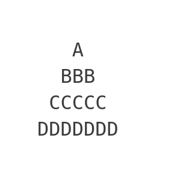</td>
    <td><a href="alpha_pattern_pyramid1_01.cpp">alpha_pattern_pyramid1_01</a></td>
  </tr>
  
  <tr>
    <td>2</td>
    <td>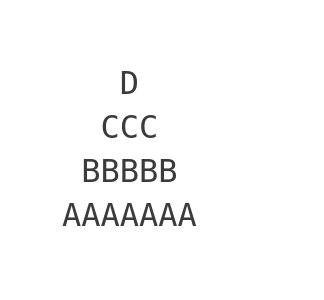</td>
    <td><a href="alpha_pattern_pyramid1_02.cpp">alpha_pattern_pyramid1_02</a></td>
  </tr>
    
  <tr>
    <td>3</td>
    <td>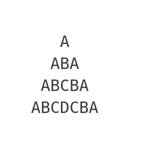</td>
    <td><a href="alpha_pattern_pyramid1_03.cpp">alpha_pattern_pyramid1_03</a></td>
  </tr>
</table>
