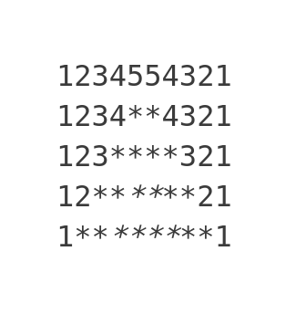

# Pattern Printing Based on Combination of Stars, Numbers & Alphabets

&nbsp;

<table>
  <tr>
    <th>Sr No</th>
    <th>Pattern</th>
    <th>Code</th>
  </tr>
  
  <tr>
    <td>1</td>
    <td></td>
    <td><a href="mix_pattern_01.cpp">mix_pattern_01</a></td>
  </tr>
</table>