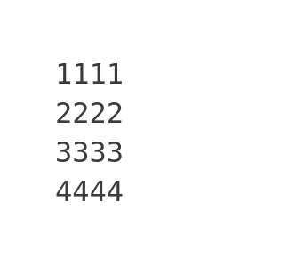

# Pattern Printing Based on Numbers
## Square Patterns
<table>
  <tr>
    <th>Pattern</th>
    <th>Code</th>
  </tr>
  <tr>
    <td></td>
    <td><ref ></td>
  </tr>

</table>

## Triangle Patterns
### Type 1
### Type 2
### Type 3
### Type 4

## Pyramid Patterns
