# Pattern Printing Based on Stars

&nbsp;

## Square Patterns

<table>
  <tr>
    <th>Sr No</th>
    <th>Pattern</th>
    <th>Code</th>
  </tr>
  
  <tr>
    <td>1</td>
    <td>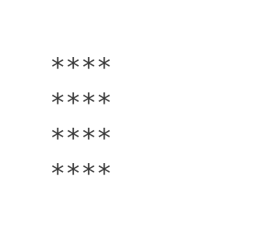</td>
    <td><a href="star_pattern_square.cpp">star_pattern_square</a></td>
  </tr>
</table>

&nbsp;

## Triangle Patterns

<table>
  <tr>
    <th>Sr No</th>
    <th>Pattern</th>
    <th>Code</th>
  </tr>

  <tr>
    <td>1</td>
    <td>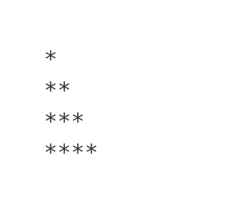</td>
    <td><a href="star_pattern_triangle_01.cpp">star_pattern_triangle_01</a></td>
  </tr>
  
  <tr>
    <td>2</td>
    <td>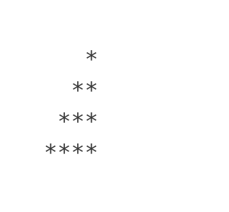</td>
    <td><a href="star_pattern_triangle_02.cpp">star_pattern_triangle_02</a></td>
  </tr>
    
  <tr>
    <td>3</td>
    <td>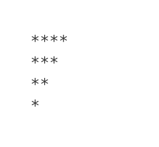</td>
    <td><a href="star_pattern_triangle_03.cpp">star_pattern_triangle_03</a></td>
  </tr>
    
  <tr>
    <td>4</td>
    <td>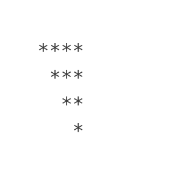</td>
    <td><a href="star_pattern_triangle_04.cpp">star_pattern_triangle_04</a></td>
  </tr>
</table>

&nbsp;

## Pyramid Patterns

<table>
  <tr>
    <th>Sr No</th>
    <th>Pattern</th>
    <th>Code</th>
  </tr>

  <tr>
    <td>1</td>
    <td>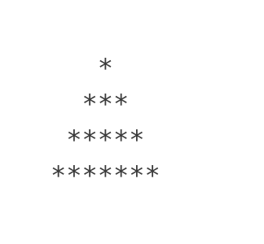</td>
    <td><a href="star_pattern_pyramid_01a.cpp">star_pattern_pyramid_01a</a>   <a href="star_pattern_pyramid_01b.cpp">star_pattern_pyramid_01b</a></td>
  </tr>

  <tr>
    <td>2</td>
    <td>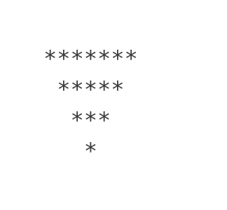</td>
    <td><a href="star_pattern_pyramid_02a.cpp">star_pattern_pyramid_02a</a>   <a href="star_pattern_pyramid_02b.cpp">star_pattern_pyramid_02b</a></td>
  </tr>
    
  <tr>
    <td>3</td>
    <td>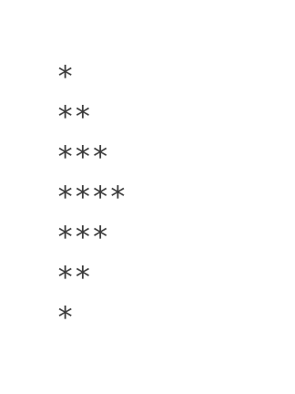</td>
    <td><a href="star_pattern_pyramid_03.cpp">star_pattern_pyramid_03</a></td>
  </tr>
</table>

&nbsp;

## Miscellaneous Patterns

<table>
  <tr>
    <th>Sr No</th>
    <th>Pattern</th>
    <th>Code</th>
  </tr>

  <tr>
    <td>1</td>
    <td>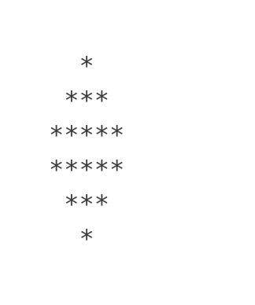</td>
    <td><a href="star_pattern_misc_01.cpp">star_pattern_misc_01</a></td>
  </tr>
  
  <tr>
    <td>2</td>
    <td>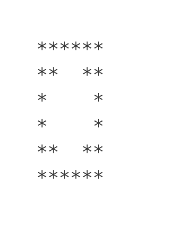</td>
    <td><a href="star_pattern_misc_02.cpp">star_pattern_misc_02</a></td>
  </tr>
    
  <tr>
    <td>3</td>
    <td>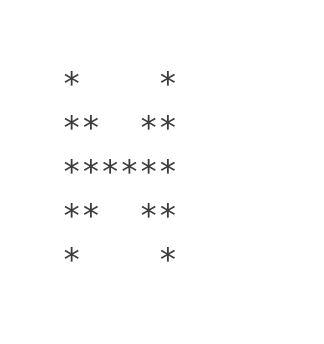</td>
    <td><a href="star_pattern_misc_03.cpp">star_pattern_misc_03</a></td>
  </tr>

  <tr>
    <td>4</td>
    <td>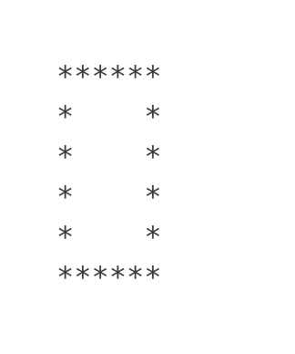</td>
    <td><a href="star_pattern_misc_04.cpp">star_pattern_misc_04</a></td>
  </tr>
</table>
